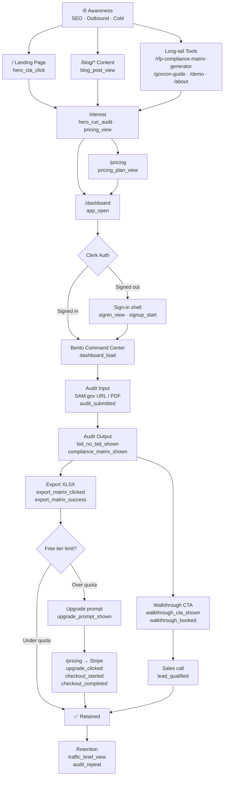

# BidSmith Funnel — Diagram + Event Spec + Cursor Implementation Prompt

---

## 1. Funnel Diagram (Mermaid)



---

## 2. Analytics Event Spec

Use these exact event names across Plausible, PostHog, or your custom tracker.
Property names are snake_case. All events include `userId` (if authed) and `plan` (`free` / `pro`).

### Awareness

| Event | Trigger | Key Properties |
|---|---|---|
| `page_view` | Every route change | `path`, `referrer`, `utm_source`, `utm_medium`, `utm_campaign` |
| `blog_post_view` | `/blog/:slug` mount | `slug`, `title`, `category` |
| `tool_page_view` | `/rfp-compliance-matrix-generator`, `/govcon-guide`, etc. | `tool_name`, `path` |

### Interest

| Event | Trigger | Key Properties |
|---|---|---|
| `hero_cta_click` | "Start free audit" / "Open app" on `/` | `cta_label`, `position` (`hero` / `footer` / `nav`) |
| `pricing_view` | `/pricing` mount | `plan_highlighted` |
| `pricing_plan_click` | Click on a plan card | `plan_name`, `billing_cycle` |
| `demo_view` | `/demo` mount | — |

### Activation

| Event | Trigger | Key Properties |
|---|---|---|
| `app_open` | `/dashboard` mount | `auth_state` (`signed_in` / `signed_out`) |
| `signin_view` | Clerk sign-in shell shown | — |
| `signup_start` | User begins sign-up flow | `method` (`email` / `google` / `github`) |
| `signup_complete` | Clerk `user.created` webhook or onMount post-auth | `method` |
| `dashboard_load` | BentoDashboard fully mounted (authed) | `plan`, `audit_count` |

### Core Product Loop

| Event | Trigger | Key Properties |
|---|---|---|
| `audit_submitted` | `POST /api/audit/pdf` or `/api/audit/link` fired | `input_type` (`url` / `pdf`), `source` (`sam` / `upload`) |
| `audit_success` | Audit response received, results rendered | `input_type`, `latency_ms` |
| `audit_error` | Inference/API error returned | `error_code`, `input_type` |
| `bid_no_bid_shown` | Bid/no-bid result rendered | `decision` (`bid` / `no_bid` / `conditional`), `score` |
| `compliance_matrix_shown` | Matrix rendered in dashboard | `requirement_count` |
| `chat_message_sent` | WorkspaceChat send fired | `message_index`, `has_context` |
| `chat_reply_received` | AI reply rendered | `latency_ms` |

### Conversion

| Event | Trigger | Key Properties |
|---|---|---|
| `export_matrix_clicked` | "Export Compliance Matrix (.xlsx)" button click | `requirement_count`, `plan` |
| `export_matrix_success` | XLSX buffer returned, download triggered | `file_size_kb` |
| `walkthrough_cta_shown` | Walkthrough CTA rendered in dashboard | `trigger` (`post_audit` / `scroll` / `timer`) |
| `walkthrough_booked` | Calendly / booking link clicked | — |
| `upgrade_prompt_shown` | Quota limit hit, upgrade UI shown | `quota_limit`, `audits_used` |
| `upgrade_clicked` | User clicks upgrade in prompt or pricing | `source` (`quota_prompt` / `pricing_page`), `plan_target` |
| `checkout_started` | Stripe checkout session created | `plan_name`, `billing_cycle` |
| `checkout_completed` | Stripe `checkout.session.completed` webhook | `plan_name`, `amount_usd`, `billing_cycle` |
| `checkout_abandoned` | User exits Stripe without completing | `plan_name` |

### Retention

| Event | Trigger | Key Properties |
|---|---|---|
| `audit_repeat` | Second+ audit submitted (same user) | `audit_count`, `days_since_first` |
| `traffic_brief_view` | `/traffic-brief` mount | — |
| `session_return` | User signs in again after prior session | `days_since_last` |

---

## 3. Cursor Implementation Prompt

Paste this into Cursor. Do not stop until all events are firing and verified.

---

**Mission: Wire every BidSmith funnel event into the codebase using a single `analytics.js` utility. Verify with console logs in dev and a Playwright spot-check. Do not touch signup tests, `.vercel/project.json`, or Clerk keys.**

### Setup — `src/utils/analytics.js`

Create this file:

```js
/**
 * BidSmith analytics — thin wrapper around Plausible (or swap for PostHog).
 * In dev: logs to console. In prod: calls window.plausible if available.
 * Never throws — analytics must never break the product.
 */

const IS_DEV = import.meta.env.DEV;

export function track(event, props = {}) {
  try {
    if (IS_DEV) {
      console.debug('[analytics]', event, props);
      return;
    }
    if (typeof window !== 'undefined' && typeof window.plausible === 'function') {
      window.plausible(event, { props });
    }
    // PostHog fallback — uncomment if using PostHog:
    // if (window.posthog) window.posthog.capture(event, props);
  } catch (_) {
    // silent
  }
}

export function identify(userId, traits = {}) {
  try {
    if (IS_DEV) { console.debug('[analytics:identify]', userId, traits); return; }
    // PostHog: window.posthog?.identify(userId, traits);
  } catch (_) {}
}
```

### Add Plausible script to `index.html` (if not already present)

```html
<!-- Analytics — add before </head> -->
<script defer data-domain="bidsmith.pro" src="https://plausible.io/js/script.js"></script>
```

### Wire events — go file by file

**`src/main.jsx` or router:**
```js
import { track } from './utils/analytics';
// On every route change:
track('page_view', { path: location.pathname, referrer: document.referrer });
```

**Landing page hero CTA button:**
```js
onClick={() => { track('hero_cta_click', { cta_label: 'Start free audit', position: 'hero' }); navigate('/dashboard'); }}
```

**`/blog/:slug` mount:**
```js
useEffect(() => { track('blog_post_view', { slug, title }); }, [slug]);
```

**`/pricing` mount:**
```js
useEffect(() => { track('pricing_view', {}); }, []);
// On plan click:
track('pricing_plan_click', { plan_name, billing_cycle });
```

**`/dashboard` mount:**
```js
useEffect(() => {
  track('app_open', { auth_state: isSignedIn ? 'signed_in' : 'signed_out' });
  if (isSignedIn) track('dashboard_load', { plan, audit_count });
}, [isSignedIn]);
```

**Audit submission (`POST /api/audit/pdf` or `/api/audit/link`):**
```js
// Before fetch:
track('audit_submitted', { input_type, source });
// On success:
track('audit_success', { input_type, latency_ms });
// On error:
track('audit_error', { error_code, input_type });
```

**Bid/no-bid result render:**
```js
useEffect(() => {
  if (result) track('bid_no_bid_shown', { decision: result.decision, score: result.score });
}, [result]);
```

**Compliance matrix render:**
```js
useEffect(() => {
  if (requirements?.length) track('compliance_matrix_shown', { requirement_count: requirements.length });
}, [requirements]);
```

**WorkspaceChat send:**
```js
// On send:
track('chat_message_sent', { message_index: messages.length, has_context: !!auditContext });
// On AI reply received:
track('chat_reply_received', { latency_ms });
```

**Export XLSX button:**
```js
onClick={() => {
  track('export_matrix_clicked', { requirement_count, plan });
  handleExport().then(() => track('export_matrix_success', { file_size_kb }));
}}
```

**Walkthrough CTA:**
```js
// On render:
track('walkthrough_cta_shown', { trigger: 'post_audit' });
// On click:
track('walkthrough_booked', {});
```

**Upgrade prompt:**
```js
// On quota hit:
track('upgrade_prompt_shown', { quota_limit, audits_used });
// On upgrade click:
track('upgrade_clicked', { source: 'quota_prompt', plan_target: 'pro' });
```

**Stripe checkout (client-side):**
```js
// Before redirect to Stripe:
track('checkout_started', { plan_name, billing_cycle });
// On return from Stripe success URL:
track('checkout_completed', { plan_name, amount_usd, billing_cycle });
```

### Verification

After wiring, run `npm run dev` and open browser console. Navigate each route and confirm `[analytics] event_name {...}` logs appear for:
- `page_view` on every route change
- `hero_cta_click` on landing CTA
- `audit_submitted` when an audit is run
- `export_matrix_clicked` on export button
- `dashboard_load` after sign-in

### Commit

```
feat(analytics): wire full funnel event tracking via analytics.js utility
```

Push to `main`.

**Do not touch:** `signup-export-flow.spec.ts`, `.vercel/project.json`, Clerk/Stripe keys, Railway env vars.
