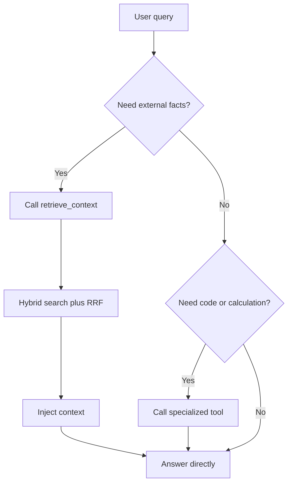

In agentic RAG, the model chooses whether to call retrieval tools instead of always injecting context.

## Decision flow



## Tool description quality

<Tabs>
  <Tab title="Good">
    "Use this tool for ARIS policies, docs, release details, and system behavior. If facts are uncertain, call this tool before answering."
  </Tab>
  <Tab title="Poor">
    "Searches database."
  </Tab>
</Tabs>

## Empty-result fallback

<Accordion title="Fallback sequence">
  1. Inspect why retrieval failed.
  2. Rewrite query with broader wording.
  3. Retry retrieval once.
  4. If still empty, answer with uncertainty and next-best guidance.
</Accordion>

## LangGraph routing example

```python
from typing import Annotated, Literal
from typing_extensions import TypedDict
from langgraph.graph import StateGraph

class AgentState(TypedDict):
    messages: Annotated[list, add_messages]

def router(state: AgentState) -> Literal["retrieve", "end"]:
    last_message = state["messages"][-1]
    return "retrieve" if last_message.tool_calls else "end"

workflow = StateGraph(AgentState)
workflow.add_node("agent", agent_node)
workflow.add_node("retrieve", tool_node)
workflow.set_entry_point("agent")
workflow.add_conditional_edges("agent", router)
workflow.add_edge("retrieve", "agent")
app = workflow.compile()
```
