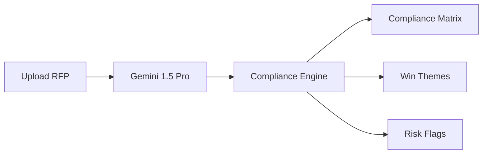

BidSmith automates the most time-consuming parts of government contracting — from parsing RFP requirements to generating a compliance matrix and win themes — in under 30 seconds.

## How It Works

## Credits

Each analysis costs **1 credit**. New accounts receive 5 free credits on signup.

| Package | Credits | Price |
|---|---|---|
| Starter | 25 | $20 |
| Pro | 100 | $70 |
| Enterprise | Custom | Contact us |

<Info>
  Credits are deducted atomically. If an analysis fails, your credit is automatically refunded.
</Info>

## Supported Formats

| Format | Max Size |
|---|---|
| PDF | 10 MB |
| DOCX | 5 MB |
| TXT | 1 MB |

## Get Started

<CardGroup cols={2}>
  <Card title="Analyze an RFP" icon="file-magnifying-glass" href="/bidsmith/analyze-rfp">
    Step-by-step guide to your first analysis.
  </Card>
  <Card title="Credits & Billing" icon="coins" href="/bidsmith/credits">
    How to purchase credits and track usage.
  </Card>
</CardGroup>
