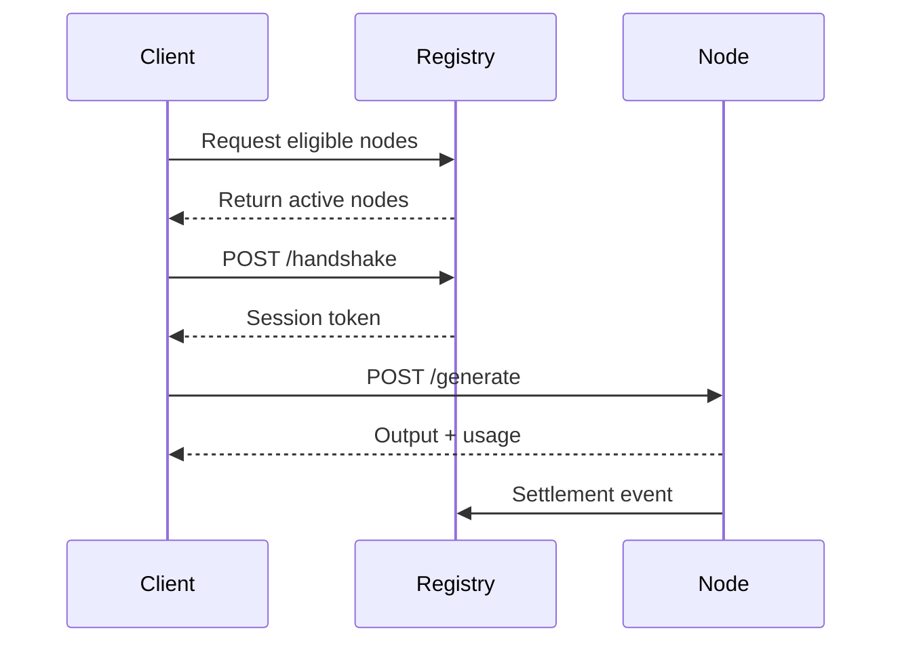

ARIS is composed of three primary systems: registry, worker nodes, and clients.

## Core components

<CardGroup cols={3}>
  <Card title="Registry" icon="database">
    Handles authentication, node discovery, and usage settlement.
  </Card>
  <Card title="Worker nodes" icon="cpu">
    Execute inference jobs and report usage to the registry.
  </Card>
  <Card title="Clients" icon="terminal">
    SDK-enabled applications that submit prompts and receive results.
  </Card>
</CardGroup>

## Request lifecycle

<Steps>
  <Step title="Discovery">
    Client requests eligible nodes from the registry.
  </Step>
  <Step title="Handshake">
    Client establishes a short-lived session with a selected node.
  </Step>
  <Step title="Inference">
    Client sends prompt and receives generated output.
  </Step>
  <Step title="Settlement">
    Node reports usage and credits are reconciled.
  </Step>
</Steps>

