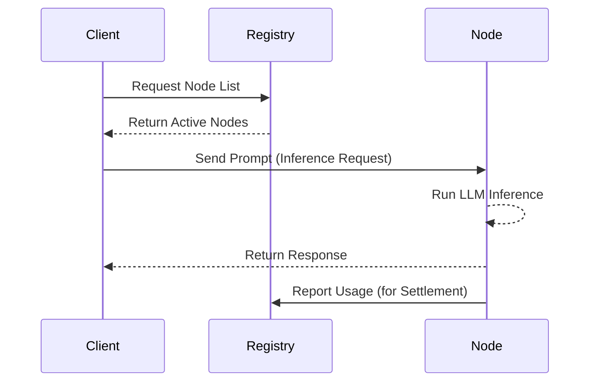

# Network Architecture

ARIS operates as a decentralized network linking **Compute Nodes**, the **Registry**, and **Clients**.

## Components

### 1. The Registry
The central (or federated) authority that manages:
- **Node Discovery**: Keeping track of active compute nodes.
- **Authentication**: issuing and validating API keys.
- **Credit Ledger**: Tracking user balances and node earnings.

### 2. Compute Nodes
Independent workers that:
- Volunteer GPU/CPU resources to the network.
- Execute inference tasks (e.g., LLM generation).
- Return results + cryptographic proofs of work.

### 3. The Client (SDK)
Your application acts as the client:
- connects to the Registry to find suitable nodes.
- sends encrypted Payloads to the selected Node.
- receives and validates the response.

## Request Flow

1. **Discovery**: Client asks Registry for a list of active nodes matching criteria (e.g. Model type).
2. **Selection**: Client selects a node (randomly or based on latency/reputation).
3. **Execution**: Client sends the prompt to the Node.
4. **Verification**: Node processes prompt and returns output.
5. **Settlement**: Registry updates the credit ledger asynchronously.

