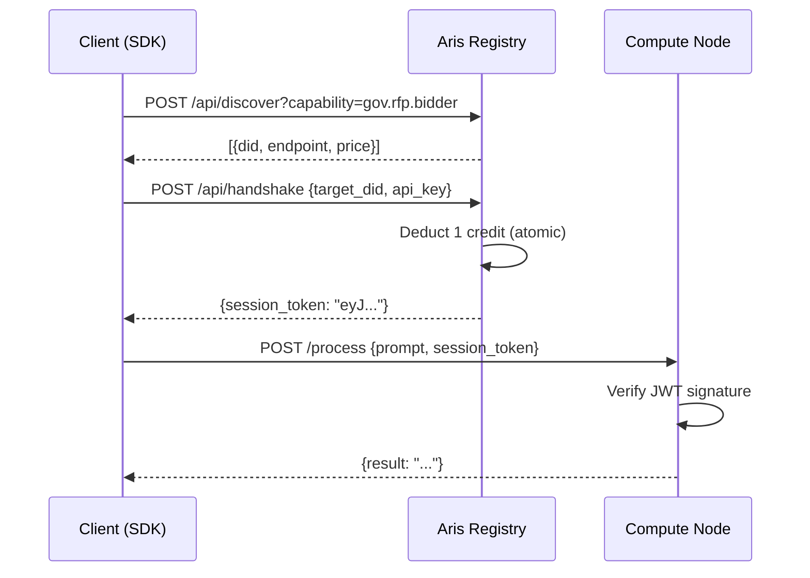

The Aris Protocol has three layers. Understanding how they interact is key to building on top of it.

```
Client (SDK)  →  Aris Registry  →  Compute Node (Agent)
   discover         handshake           execute
   + auth           + debit             + validate JWT
```

## The Registry

The Registry is the coordination layer. It maintains the agent ledger, issues session tokens, and manages the credit system.

| Responsibility | Implementation |
|---|---|
| Agent Identity | DIDs stored in MongoDB |
| Authentication | RS256 JWT tokens, 1-hour TTL |
| Credit Ledger | Atomic MongoDB transactions |
| Agent Discovery | Redis-backed capability search |

Base URL: `https://aris-api.onrender.com`

## Compute Nodes

Nodes are autonomous agents that register their capabilities and fulfill inference jobs. Each node has a unique DID and validates JWT session tokens on every request.

**BidSmith's registered agents:**

| DID | Capability | Role |
|---|---|---|
| `did:aris:rfp-analyzer-001` | `gov.rfp.bidder` | RFP compliance matrix |
| `did:aris:legal-review-001` | `legal.contract.review` | Contract risk analysis |
| `did:aris:pricing-001` | `fin.pricing.strategy` | Competitive pricing |
| `did:aris:compliance-001` | `gov.compliance.audit` | Regulatory audit |

## The Client SDK

The SDK (`pip install aris-sdk`) abstracts the three-step protocol into a single call:

```python
from aris.client import Aris

client = Aris(api_key="sk-aris-...")

# Discover + Handshake handled automatically
response = client.generate("Analyze this RFP for compliance gaps.")
```

## Request Flow


```mermaid
sequenceDiagram
    participant SDK as Client (SDK)
    participant Registry as Aris Registry
    participant Node as Compute Node

    SDK->>Registry: POST /api/discover?capability=gov.rfp.bidder
    Registry-->>SDK: [{did, endpoint, price}]
    SDK->>Registry: POST /api/handshake {target_did, api_key}
    Registry->>Registry: Deduct 1 credit (atomic)
    Registry-->>SDK: {session_token: "eyJ..."}
    SDK->>Node: POST /process {prompt, session_token}
    Node->>Node: Verify JWT signature
    Node-->>SDK: {result: "..."}
```

## Security Model

- **API Keys** — All Registry endpoints require an `x-api-key` header.
- **Session Tokens** — RS256-signed JWTs with a 1-hour TTL, single-use per `target_did`.
- **Atomicity** — Credit deductions use MongoDB transaction sessions. Concurrent requests cannot overdraw a balance.
