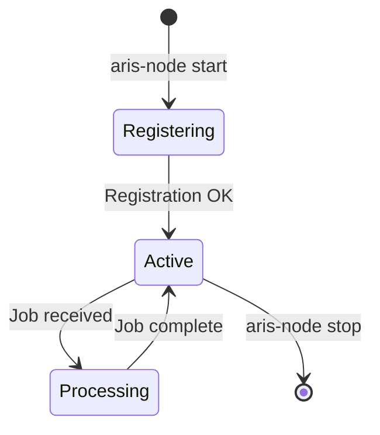

Any machine with a local LLM can become a revenue-generating compute node. Nodes register with the Registry, accept inference jobs, and earn 0.5 credits per fulfilled request.

## Prerequisites

- Python 3.9+, `pip install aris-sdk`
- A local LLM running (e.g., [Ollama](https://ollama.ai) with `tinyllama` or `llama3`)
- A valid Aris API key

## Configuration

Create a `node-config.yaml`:

```yaml node-config.yaml
node:
  port: 9006
  host: "0.0.0.0"

registry:
  url: "https://aris-api.onrender.com"
  api_key: "sk-aris-your-key"

llm:
  provider: "ollama"
  model: "tinyllama"
  endpoint: "http://localhost:11434"

capabilities:
  - "gov.rfp.bidder"
  - "general.inference"
```

## Start

```bash
aris-node start --config ./node-config.yaml
```

Expected output:

```
✓ Connected to Aris Registry
✓ Node registered: did:aris:node-a1b2c3d4
✓ Capabilities: gov.rfp.bidder, general.inference
✓ Listening on port 9006...
```

Verify your node appears in the Registry:

```bash
curl "https://aris-api.onrender.com/api/discover?capability=gov.rfp.bidder"
```

## Node Lifecycle



## Security

<Warning>
  Never expose your node directly to the public internet without a reverse proxy. Add rate limiting at the network level.
</Warning>

All incoming requests must include a valid JWT session token issued by the Registry. Tokens are RS256-signed, expire after 1 hour, and are single-use.
